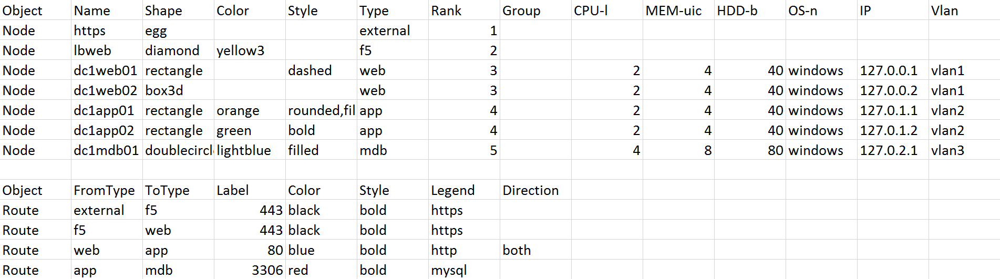
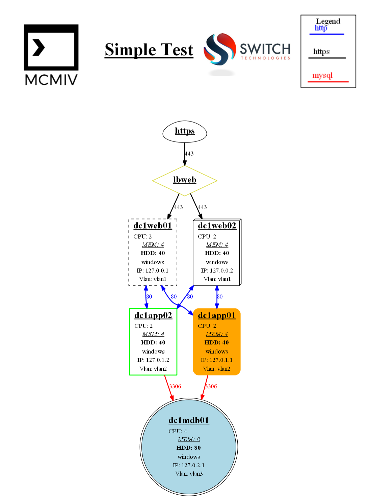

# Scripted Diagrams - PS-Diagram
Guide to using the module for generating application/server diagrams from csv files.

## Sample Diagrams:
- [Basic Test Csv](images/basictest-csv.png)
- [Basic Test Diagram](images/basictest.png)
- [Simple Test Csv](images/simpletest-csv.png)
- [Simple Test Diagram](images/simpletest.png)
- [Advanced Test Csv](images/advancedtest-csv.png)
- [Advanced Test Diagram](images/advancedtest.png)
- Advanced Nested Csv Files - ***sources\cluster\*.csv***
- [Advanced Nested Diagram](images/advancednested.png)


## This module has a few requirements:
1. Clone the repo: [https://github.com/mcmiv413/PS-Diagram](https://github.com/mcmiv413/PS-Diagram)
2. Graphviz: [Download Graphviz](http://www.graphviz.org/Download_windows.php)
3. PSGraph: From powershell **admin** prompt - `Find-Module PSGraph | Install-Module`
    - [PSGraph Github](https://github.com/KevinMarquette/PSGraph)

## Step-by-step guide
The csv file contains information on 2 main types of objects:

#### Node

Nodes are any primary object that other objects may connect to, this could be a server, or a load blancer, or a database, etc.

##### Properties can be listed for these objects to describe the name/shape/type/rank/group/etc.
- `Name` should be a unique value
- `Shape` can be any one of the shapes listed here: [Shapes](http://www.graphviz.org/content/node-shapes)
- `Type` can be anything and is utilized by the route object to determine what types of nodes should route to other types: ie sec11p2bbapp01 is type app
- `Rank` is int and is used to determine the order top to bottom that the node should sit in. May be useful to think of this as network layer.
- `Group` is used to group all nodes that belong to the same group, I've used it to denote datacenters.
- `Additional Fields` are all suggested fields, but anything past group are arbitrary.
    - Each additional field can have "switch" parameters:
        - b = bold
        - u = underline
        - i = italic
        - l = left align
        - c = center align
        - r = right align
        - n = no label ( property name will not be displayed in output)
    - For example `CPU-biln` will show the value for CPU in bold, italic, left aligned, with no label

### Advanced Node type
This script is capable of doing nested diagrams using the "CluserNode" object
- For object type `clusternode` the script will look for an additional csv file with the name of the object, a new subdiagram will be generated based on the additional csv
- This image will be embedded into the node object, clusternodes can go as many levels deep as are defined.
- [Advanced Nested Diagram](images/advancednested.png)

#### Route
Routes are the lines drawn between nodes, this is defined as a route from 1 node type to another node type.
##### Properties can be used as below:
- `FromType` is the source node **type**
- `ToType` is the destination node **type**
- `Label` is the label for the route, typically port number is used here
- `Color` can be any of these from the x11 list: [Colors](http://www.graphviz.org/content/color-names)
- `Style` is any of the styles defined for edges: [Styles](http://www.graphviz.org/doc/info/attrs.html#k:style)
- `Legend` is the label used in the autogenerated legend: ie. Label = 443, Legend = https
- `Direction` can be left blank for single direction, for bidirectional use 'both' [Direction](http://www.graphviz.org/doc/info/attrs.html#k:dirType)

## Sample CSV:

##### Once the csv(s) have been created the script can be used to generate a diagram:
- `import-module %path_to_module%\PS-Diagram`
- `new-psdiagram`: Creates a new diagram based off of an input csv file
    - `-logo`: File name or url to logo file to be used
    - `-logo2`: File name or url to secondary url to be used
    - `-inputcsv`: File name for csv file to be loaded
    - `-title`: Header title for diagram (used with -enableheader)
    - `-destination`: File name to be used for final diagram
    - `-outputgraphtext`: switch to enable the dot graph text to be written to c:\temp(used to inspect problems with graph generation)
    - `-enableheader`: switch to enable the header, contains both logos, title, and legend
    - `-enablelegend`: switch toggles legend generation, also requires enable header
    - `-invokediagram`: switch toggles the launch of the diagram after it is created
    - `-ranksep`: amount to seperate the ranks by, default is 1.5
    - `-nodesep`: amount to seperate the nodes by, default is .5
    - `-newrank`: graphviz undocumented feature allowing us ro rank nodes in different groups at the same level

- `new-psdiacsv`: Creates a new csv template.
    - `-csvfilename`: File name for new csv template
### Example:
```powershell
import-module %modulepath%\PS-Diagram -force
$path = $(Get-Module ps-diagram).modulebase
new-psdiagram `
 -inputcsv $path\source\simpletest.csv `
 -invokediagram `
 -enableheader `
 -enablelegend `
 -title "Simple Test" `
 -logo $path\images\MCMIV-logo.png `
 -logo2 $path\images\switchtechnologylogo.jpg `
 -destination $path\images\simpletest.png `
 -ranksep .5 `
 -nodesep .5
```


 
